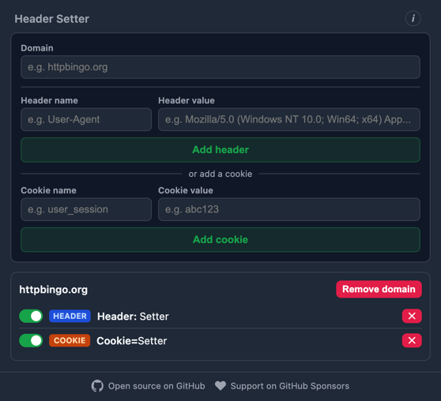

# Header Setter

[](LICENSE)

A simple, open-source browser extension (Manifest V3) for Chrome and Firefox to set custom HTTP request headers and cookies per domain.



## Extensions

Install from the official stores — recommended for most users, since it's also the only way to receive automatic updates.

- **Chrome**: https://chromewebstore.google.com/detail/header-setter/hobhlonbmogpejnjainlmbmgfabhglha
- **Firefox**: https://addons.mozilla.org/de/firefox/addon/c6a223e979eb44a18489/

## Local installation

For development, or to try a version before it reaches the store.

### Chrome

1. Clone this repository
2. Open `chrome://extensions`
3. Enable **Developer mode** (top right)
4. Click **Load unpacked** and select the project folder

### Firefox

A signed `.xpi` is attached to the [releases page](https://github.com/otto-wagner/header-setter/releases) once Mozilla approves a new version — new submissions await review first, so the latest one may not be there yet.

1. Grab the signed `.xpi` from the releases page
2. Open `about:addons`
3. Click the gear icon → **Install Add-on From File...** and select the downloaded `.xpi`

Without signing (temporary, for development — removed on browser restart):

1. Clone this repository
2. Stage the extension with a Firefox-compatible background field (Firefox has no `background.service_worker` support in Manifest V3):
   ```sh
   mkdir -p dist
   cp -r manifest.json src icons dist/
   jq '.background = {"scripts": ["src/background.js"], "type": "module"}' manifest.json > dist/manifest.json
   ```
3. Open `about:debugging#/runtime/this-firefox`
4. Click **Load Temporary Add-on...** and select `dist/manifest.json`

## Host routing proxy

Setting headers and cookies works with the extension alone. Rewriting the Host header additionally requires `header-setter-proxy`:


```sh
brew tap otto-wagner/header-setter https://github.com/otto-wagner/header-setter
brew install header-setter-proxy
header-setter-proxy serve
```

On Windows, use Scoop instead: see [`proxy/README.md`](proxy/README.md#install).

## Permissions & privacy

This extension does **not** collect, transmit, or share any data. All rules stay on your device in local browser storage. There is no remote server, analytics, or tracking of any kind — the full source is available in this repository for review.

Host routing sends the routes to the proxy on `127.0.0.1:8900`, which runs on your own machine, binds to loopback only, and relays the routed connections without decrypting or logging their content.

## Support

If this extension is useful to you, you can support its open-source development via [GitHub Sponsors](https://github.com/sponsors/otto-wagner).

## Acknowledgements

Thanks to [go-httpbin](https://github.com/mccutchen/go-httpbin) for providing [httpbingo.org](https://httpbingo.org/headers).

## License

MIT — see [LICENSE](LICENSE).
